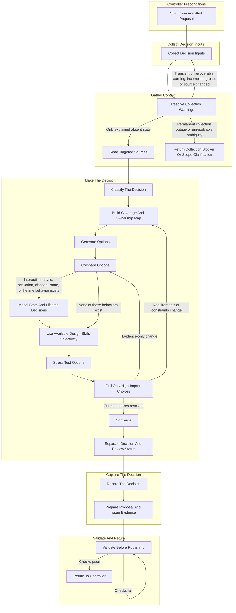

# Dathomir Proposal Decision

This skill is repository-specific.
Use it to turn an ambiguous Dathomir design request into a bounded Proposal that can be reviewed, implemented later, and traced to GitHub Issues and the repository's SPEC conventions.

Do not use it for a one-shot explanation, routine implementation with an already accepted contract, or generic code review.

## Source Of Truth

Follow this record hierarchy:

- GitHub Issue: scope, hierarchy, dependencies, progress, acceptance boundary, completion state, and the canonical owner and blocking status of deferred work.
- When present, the issue-numbered Proposal matching `SPEC/proposals/**/{issue}.typ`: design rationale, accepted ADRs, behavior contracts, and deferred questions. The collector searches that whole pattern; treat a missing match as an intentional absent state and expect one unambiguous match when present.
- Package `SPEC.typ` and `implementation.test.ts`: adopted behavior before production implementation.
- `implementation.ts`: implementation of the adopted specification, never the source of the design decision.

Do not create a competing `CONTEXT.md`, local decision ledger, or generic RFC file for this workflow.
Use the Issue and Proposal path above.

The `manage-github-issue-work` controller must load the relevant `AGENTS.md`, admit or reuse the owning Proposal Issue, and prepare the work branch before this skill performs domain work.

## Workflow At A Glance

Follow these stages in order. Read the linked reference before executing that stage. Repeat Resolve Collection Warnings, Grill Only High-Impact Choices, or Validate Before Publishing whenever its exit conditions are not satisfied.

If the request is only explanatory and changes no repository or GitHub state, do not enter this flow; answer it as a read-only request without Issue admission.

The stage and step titles in the diagram are the navigation keys for the detailed workflow. Keep them synchronized when adding, removing, or moving a step.

## Stage References

Read only the references needed for the current stage, and read them directly from this skill directory. References are one level deep so that each stage can be loaded without reading the entire workflow.

- **Controller Preconditions**: [start-work.md](references/start-work.md)
  - `Start From Admitted Proposal`
- **Collect Decision Inputs**: [collector.md](references/collector.md)
  - Run the Node.js collector before interpreting requirements.
- **Gather Context**: [gather-context.md](references/gather-context.md)
  - `Resolve Collection Warnings`
  - `Return Collection Blocker Or Scope Clarification`
  - `Read Targeted Sources`
- **Make The Decision**: [make-decision.md](references/make-decision.md)
  - `Classify The Decision`
  - `Build Coverage And Ownership Map`
  - `Generate Options`
  - `Compare Options`
  - `Model State And Lifetime Decisions`
  - `Use Available Design Skills Selectively`
  - `Stress Test Options`
  - `Grill Only High-Impact Choices`
  - `Converge`
  - `Separate Decision And Review Status`
- **Capture The Decision**: [capture-decision.md](references/capture-decision.md)
  - `Record The Decision`
  - `Prepare Proposal And Issue Evidence`
- **Validate And Return**: [validate-and-handoff.md](references/validate-and-handoff.md)
  - `Validate Before Publishing`
  - `Return To Controller`

## Shared Rules

- Keep the owning Issue canonical for scope, requirements, acceptance criteria, and every deferred owner's blocking status. Keep the Proposal canonical for design rationale and contracts; let the Proposal or ADR mirror deferred ownership and blocking status only.
- Treat the collector output as disposable evidence, not a decision ledger.
- Keep native Issue relationships separate from textual Proposal fields.
- Preserve the distinction among current supported behavior, future profiles, deferred work, and non-goals.
- Treat a missing required field as incomplete input, not as an empty requirement. Treat every `Acceptance criteria` item as mandatory by default; change that boundary only through an explicit scope change recorded in the owning Issue.
- Do not defer an item listed in the owning Issue's `Decision to make` or `Acceptance criteria`; resolve it in the current Proposal or stop for scope clarification.
- Keep execution ownership, identity, lifetime, failure, and resource guarantees explicit.
- Never change the meaning of a `Status.Accepted` ADR in place; supersede it with a later ADR.
- Do not update implementation before its SPEC and executable tests.
- Preserve unrelated worktree changes and do not use destructive Git commands.
- Do not merge a PR until the user explicitly requests merge.

## Failure Modes To Prevent

- Endless grilling over details owned by a later Issue.
- Treating a reactive input as server-only merely because the first profile is static.
- Inferring execution responsibility by scanning arbitrary DOM structure.
- Adding a content identity when the client cannot independently verify it.
- Hiding an unsupported handoff behind click-time network fallback or legacy behavior.
- Rewriting an Accepted ADR instead of superseding it.
- Defining a state or ownership rule in one Proposal section while omitting the same actor or transition from its error cases or evidence matrix.
- Updating implementation before its SPEC and executable tests.
- Creating a second canonical record outside the Issue and Proposal.
- Declaring completion while checks, review comments, or merge evidence are missing.

## Completion Checklist

- [ ] The controller admitted the owning Issue as a `Proposal` and recorded the branch, base, and starting revision.
- [ ] Collect the input bundle and resolve or explain every warning.
- [ ] Treat every missing required field as incomplete and restore it or return an explicit owning-Issue scope-change request before continuing.
- [ ] Confirm every input bundle source group is `collected` or intentionally `absent`; resolve every `incomplete` group.
- [ ] Treat every `Acceptance criteria` item as mandatory unless an explicit scope change is recorded in the owning Issue.
- [ ] Classify terms, ownership, identity, lifetime, failure, and deferrals explicitly.
- [ ] Create one coverage-map row for every collected `requirements.*` candidate and preserve its provenance.
- [ ] Prepare every `Deferred` item's owner and blocking status for the controller; mirror it only in the Proposal or ADR.
- [ ] Generate and materially compare options for every current decision requirement.
- [ ] Apply the decision criteria and every mandatory acceptance criterion to every viable option.
- [ ] Stress-test every viable option against relevant success, failure, concurrency, and lifetime scenarios.
- [ ] Publish auditable option-comparison and stress-test evidence in the final Proposal and return the owning Issue summary evidence to the controller.
- [ ] Record the selected option, rejected alternatives, rationale, trade-offs, and remaining owned deferrals.
- [ ] For a Proposal with interaction, async, activation, or disposal behavior, define a canonical state model covering entry, exit, terminality, retry, and resources.
- [ ] Separate ADR decision status from GitHub review status.
- [ ] Stop grilling under the stated criteria.
- [ ] Supersede Accepted ADRs rather than silently rewriting them.
- [ ] Verify that the Proposal and Issue scope agree.
- [ ] Run Typst compilation and tracked and untracked whitespace checks.
- [ ] Validate all tracked and untracked files in the skill directory and the shared collector script and test; regenerate metadata only when it is stale.
- [ ] Return Proposal content, validation evidence, and review findings to the controller for branch, PR, and Issue state management.
