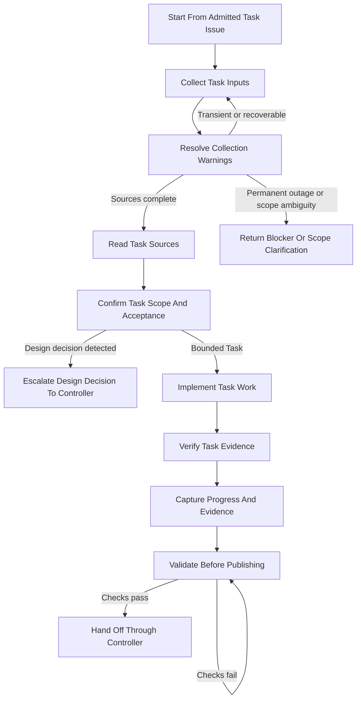

# Dathomir Task Work

Use this skill after `manage-github-issue-work` has admitted a GitHub Issue whose type is `Task`.
The controller remains responsible for Issue identity, hierarchy, dependencies, branch state, PR state, and final handoff.
This skill owns the Task-specific execution contract.

Do not use this skill for a design decision.
When a Task introduces a new caller-visible behavior, ownership boundary, interface, identity rule, lifetime rule, failure outcome, or resource guarantee, stop and return a design-decision escalation to the controller before continuing.

## Source Of Truth

- The owning Task Issue is canonical for outcome, preconditions, work, verification, acceptance criteria, dependencies, non-goals, and scope changes.
- The collected JSON bundle is disposable evidence and must not become a second task ledger.
- Package `SPEC.typ` and `implementation.test.ts` define adopted package behavior before production implementation.
- `implementation.ts` implements the adopted specification and does not redefine the Task scope.

## Workflow At A Glance

Follow these stages in order.
Read the linked reference before executing each stage.
Repeat Resolve Collection Warnings or Validate Before Publishing whenever their exit conditions are not satisfied.

## Stage References

Read only the references needed for the current stage.

- **Start Work**: [start-work.md](references/start-work.md)
  - `Start From Admitted Task Issue`
- **Collect Task Inputs**: [collect-task-inputs.md](references/collect-task-inputs.md)
  - Run the shared Issue collector before interpreting Task requirements.
- **Gather Task Context**: [gather-context.md](references/gather-context.md)
  - `Resolve Collection Warnings`
  - `Return Blocker Or Scope Clarification`
  - `Read Task Sources`
- **Execute Task Work**: [execute-task.md](references/execute-task.md)
  - `Confirm Task Scope And Acceptance`
  - `Implement Task Work`
  - `Verify Task Evidence`
- **Validate And Hand Off**: [validate-and-handoff.md](references/validate-and-handoff.md)
  - `Capture Progress And Evidence`
  - `Validate Before Publishing`
  - `Hand Off Through Controller`

## Shared Rules

- Treat every required Task field as evidence that must be restored, clarified, or explicitly changed in the owning Issue.
- Treat every `Acceptance criteria` candidate as mandatory unless the owning Task Issue records an explicit scope change.
- Create exactly one coverage row for every collected `issueRequirements.*` candidate and preserve its source.
- Map `Outcome` and `Work` to the intended Task result.
- Map `Verification` and every `Acceptance criteria` candidate to explicit evidence.
- Do not invent design options, ADRs, or Proposal Progress values for a bounded Task.
- Keep native Issue relationships separate from the textual `Dependencies` field.
- Preserve unrelated worktree changes and do not use destructive Git commands.
- Do not merge a PR until the user explicitly requests merge.

## Completion Checklist

- [ ] The controller admitted the owning Issue as a `Task`.
- [ ] The Task branch, base, and starting revision are recorded.
- [ ] The input bundle was collected and every warning was resolved or returned to the controller.
- [ ] Every source group is `collected` or intentionally `absent`.
- [ ] Every collected `issueRequirements.*` candidate has one provenance-preserving coverage row.
- [ ] `Outcome` and `Work` map to the intended Task result.
- [ ] `Verification` and every mandatory acceptance criterion map to evidence.
- [ ] Any newly discovered design decision was escalated to the controller and the controller confirmed the Proposal Issue.
- [ ] Focused tests, typecheck, lint, formatting, and relevant repository checks pass.
- [ ] Progress and evidence are prepared for the controller to record on the owning Issue.
- [ ] The controller has the information required for PR handoff.
